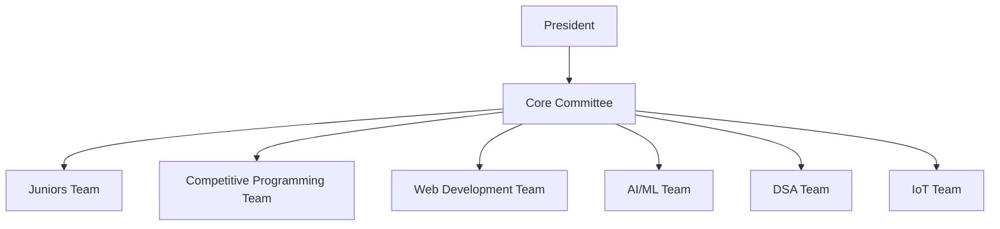
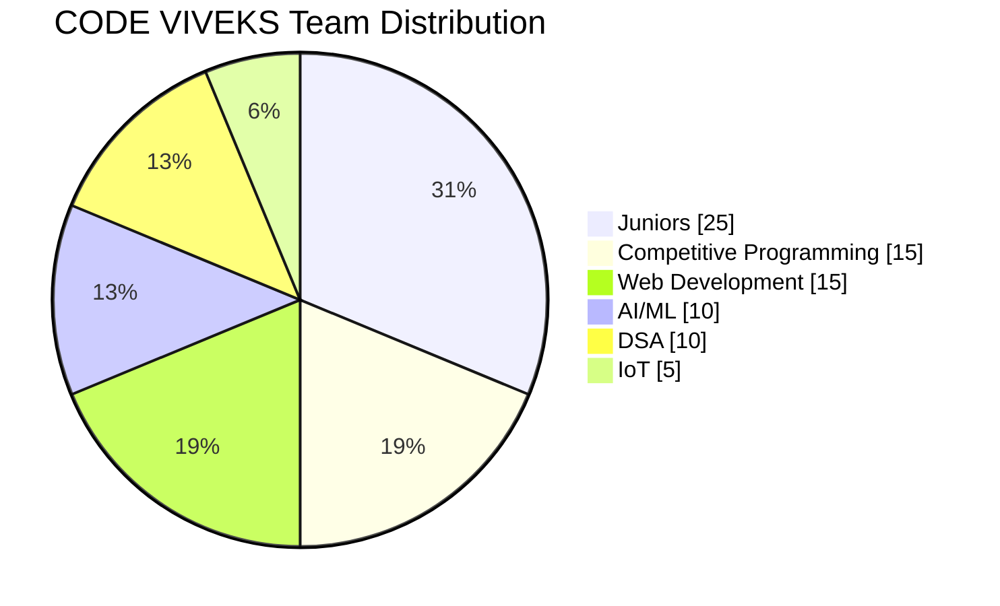
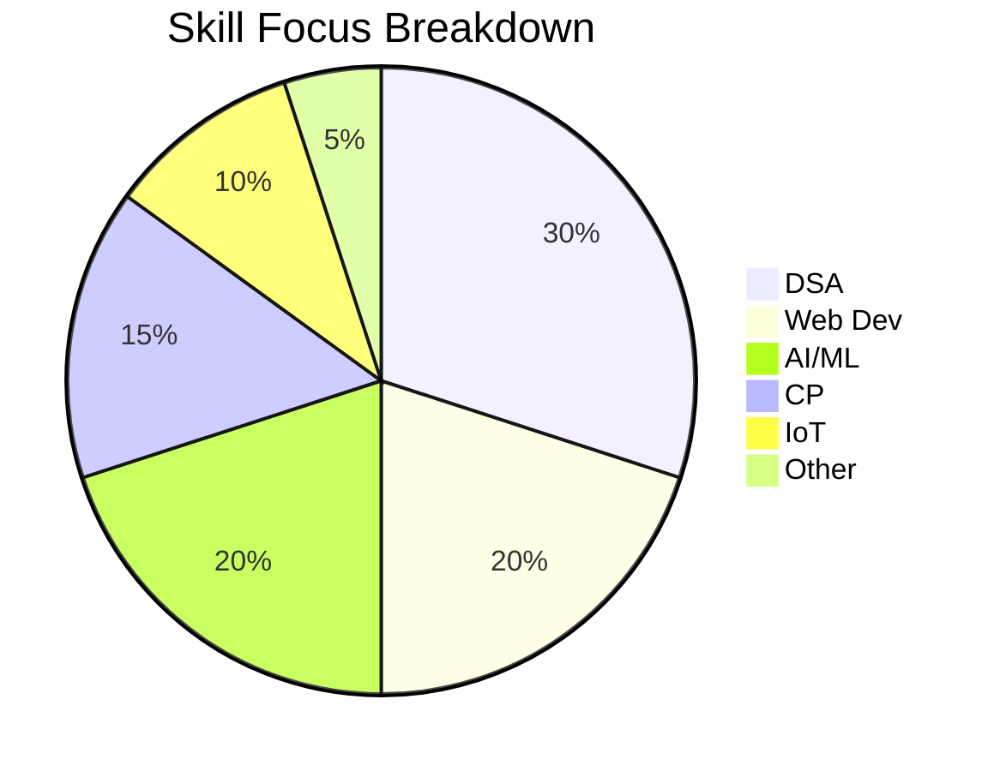

<!-- ========================================================= -->
<!--               CODE VIVEKS — OFFICIAL README               -->
<!-- ========================================================= -->

<p align="center">
  
</p>

<p align="center">
  
</p>

<p align="center">
  
  
  
  
</p>

---

# 📚 Table of Contents
- [🔥 Overview](#-overview)
- [🏛️ Structure](#%EF%B8%8F-structure)
- [🧠 Teams](#-teams)
- [📊 Charts](#-charts)
- [🔥 GitHub Stats](#-github-stats)
- [🚀 Activities](#-activities)
- [🤝 Contributing](#-contributing)
- [📬 Contact](#-contact)

---

# 🔥 Overview

Official Coding Club of **SVIT** — focused on development, AI, CP, DSA, IoT, and innovation.

🎯 **Vision:** Build a strong coding culture  
🚀 **Mission:** Learn, Build, Collaborate, Innovate  
👥 **Members:** 150+ active learners  

---

# 🏛️ Structure



---

# 🧠 Teams

- 🧑‍🏫 **Juniors Team** → Programming foundation  
- ⚔️ **CP Team** → CF, CC, ICPC  
- 💻 **Web Dev Team** → MERN, APIs, Deployments  
- 🤖 **AI/ML Team** → ML models, Kaggle, Deep Learning  
- 🧩 **DSA Team** → Algorithms, Interview Prep  
- 🔌 **IoT Team** → Arduino, sensors, microcontrollers  

---

# 📊 Charts

### 📈 Member Distribution


### 📉 Skill Focus


---

# 🔥 GitHub Stats

<p align="center">
  
  
</p>


---

# 🚀 Activities

### 🗓 Weekly
- 🔸 Coding sprints  
- 🔸 CP contests  
- 🔸 Web development sprint  
- 🔸 ML model building  
- 🔸 IoT prototyping  

### 📆 Monthly
- 🔹 Hackathons  
- 🔹 Technical workshops  
- 🔹 Project demo day  

### 🏆 Annual
- 🟧 36-hour mega hackathon  
- 🟧 Coding bootcamp  
- 🟧 Tech symposium  

---

# 🤝 Contributing

```md
1. Fork the repo  
2. Create a feature branch  
3. Commit your changes  
4. Push to your branch  
5. Open a Pull Request  
```

---

# 📬 Contact

📧 **Email:** codevivekssvit2025@gmail.com  
🌐 **GitHub:** https://github.com/CodeVivekSVIT2025-dev 
📸 **Instagram:** @code_viveks

